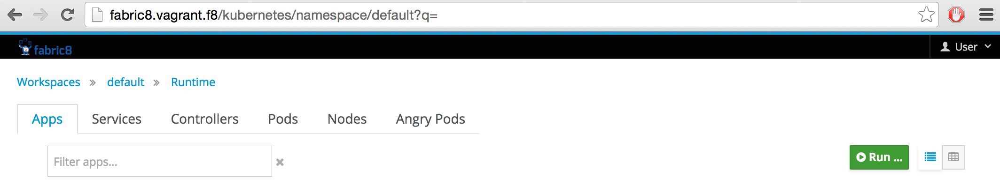
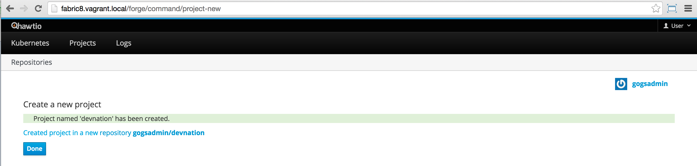
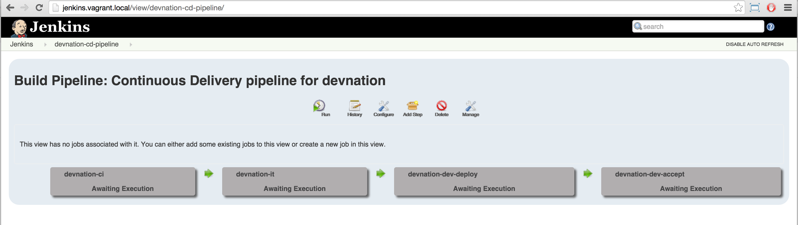
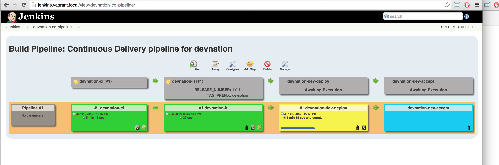

:sectanchors:
:toc: macro
:toclevels: 2
:toc-title: Table of Content
:numbered:

= Continuous Delivery & Integration scenario

toc::[]

== Goals

== Overview

= Prerequisites

- https://www.vagrantup.com/downloads.html[Vagrant]
- https://www.virtualbox.org/[VirtualBox]
- https://git-scm.com/downloads[Git client]
- https://github.com/openshift/origin/releases/tag/v1.0.6[Openshift Client - V1.0.6 (optional)]
- https://github.com/fabric8io/gofabric8/releases[gofabric8 client (OPTIONAL)]

= Installation

== Setup your local machine 

Here is the description of the steps to be followed in order to setup the environment and run the demo

. Install the Openshift Client on your machine (Optional)
.. Download the tar.gz file and uncompress the content locally
.. Edit your bash file to add a variable `OPENSHIFT_HOME` and specify the location of the content unzipped
+
----
export OPENSHIFT_HOME=~/MyApplications/openshift-origin-v1.0.6
export PATH=$OPENSHIFT_HOME:$PATH
----
+
.. Source your bash file tobe able to run `oc` command within one of your terminal

. Install GoFabric8 Client binary on your machine (Optional)
.. Download the tar.gz file and uncompress the content locally
.. Edit your bash file to add a variable `GOFABRIC8_HOME` and specify the location of the content unzipped
+
----
export GOFABRIC8_HOME=~/MyApplications/gofabric8-0.3.13
export PATH=$GOFABRIC8_HOME:$PATH
----
+
.. Source your bash file to be able to run `gofabric8` command within one of your terminal

== Install Vagrant Fabric8 config file

. Clone the https://github.com/fabric8io/fabric8-installer.git[Fabric8-installer] git project or download/unzip it from this https://github.com/fabric8io/fabric8-installer/archive/master.zip[repository address]
. Unzip the content
. Open a Terminal and move to the directory of `fabric8-installer/vagrant/openshift`
. Start Vagrant using this command
+
----
vagrant up
----
+
When the VirtualBox machine has been started and created successfully, you should be able to see this message within the console
+
----
==> default: --------------------------------------------------------------
==> default: Fabric8 pod is running! Who-hoo!
==> default: --------------------------------------------------------------
==> default:
==> default: Now open the fabric8 console at:
==> default:
==> default:     http://fabric8.vagrant.f8/
==> default:
==> default: When you first open your browser Chrome will say:
==> default:
==> default:    Your connection is not private
==> default:
==> default: * Don't panic!
==> default: * Click on the small 'Advanced' link on the bottom left
==> default: * Now click on the link that says 'Proceed to fabric8.vagrant.f8 (unsafe)' bottom left
==> default: * Now the browser should redirect to the login page. Enter admin/admin
==> default: * You should now be in the main fabric8 console. That was easy eh! :)
==> default: * Make sure you start off in the 'default' namespace.
==> default:
==> default: To install more applications click the Run... button on the Apps tab.
==> default:
==> default: We love feedback: http://fabric8.io/community/
==> default: Havefun!
==> default:
==> default: Now open the fabric8 console at:
==> default:
==> default:     http://fabric8.vagrant.f8/
==> default:
==> default: --------------------------------------------------------------
==> default: deploymentconfigs/docker-registry
==> default: services/docker-registry
----

== Pull cd-pipeline and chat-letschat

SSH to the vagrant box using `vagrant ssh` command and issue these gofabric8 commands to download the docker images required by the cd-pipeline and letschat kube applications

----
gofabric8 pull chat-letschat
gofabric8 pull cd-pipeline
----

== Install the kube applications

. Open your web browser at this address `http://fabric8.vagrant.f8/`
+

+
. Select from the home screen the `default` namespace available within the `workspaces` and click on the `runtime` tab.
+

+
. From this screen, click on the `run` button (available top of the right part of the screen)
+


+
. Select the `chat-letschat` and `cd-pipeline` applications to be deployed for this Continuous Delivery/Integration pipeline demo.
. You can install them by clicking on the green button.
+

+
. For each application, you can tailor different keys
+


NOTE: Example, you can define the description of the gerrit git repo, the user name and password to be used to access the gerrit kube app, and so on.

== Create a Continuous Delivery Project

. Return to the `Workspaces` -> `default` namespace screen
. Click on the `Create Project` button
+

+
. If you are not yet authenticated, you will see a screen requesting that you sign in with the Gogs Server
. Encode the username (gogsadmin), password (RedHat$1) & email (gogsadmin@fabric8.io) address to access `Gogs` Server
. Click on the `signin` button
. Click on the `Create Project using wizzard` button

* Click on execute and within the next screen, you will be able to select from the maven catalog the archetype to be used "io.fabric8.archetypes:java-camel-cdi-archetype:2.2.0"
  using the catalog of "fabric8". Click on execute to request the creation of the seed, jobs & git repos

image::images/fabric8-project-6.png[]

* When the project is created, you will be redirected to this screen



* Review what has been created in jenkins, gogs, gerrit & fabric8

.Git repo created into Gogs


.Git repo created in Gerrit Review Application
image::images/gerrit-4.png[]

.Jenkins jobs for the project created (it, dev, deploy)


.Jenkins console output
image::images/jenkins-1b.png[]

.Fabric8 CD/CI Pipeline created from the project


== Use Fabric8 Maven plugin to create a gerrit repo

. Set Kubernetes & Docker env variables
+
    source /Users/chmoulli/MyProjects/MyConferences/emea-2015/demo/scripts/set_kubernetes_env.sh
+
. Authenticate with the openshift platform using `oc login` command
+
    /Users/chmoulli/MyProjects/MyConferences/emea-2015/demo/scripts/authenticate_with_os.sh
+
. Run the Fabric8 Gerrit plugin to create a project
+
    mvn io.fabric8:fabric8-maven-plugin:2.2.61:create-gitrepo -DgerritAdminUsername="admin" -DgerritAdminPassword="secret" -Drepo="demo" -Dempty_commit="false"

* Clone the Git Gogs repo using a git command issued in a terminal to make a change & start a review process

```
   git clone http://gogs.vagrant.f8/gogsadmin/demo.git
   Cloning into 'demo'...
   remote: Counting objects: 24, done.
   remote: Compressing objects: 100% (16/16), done.
   remote: Total 24 (delta 2), reused 0 (delta 0)
   Unpacking objects: 100% (24/24), done.
   Checking connectivity... done.
```

* Add Gerrit Review hook to the project

In order to use the git review branch created within the gerrit git repo, we will add the branch, modify the git hook message in order to
generate a unique commit-id message.

Run the script and pass as parameter the directory name of the project to be created locally on your machine and the gerrit git repository (should be by example : devnation)
```
   /Users/chmoulli/MyProjects/MyConferences/emea-2015/demo/scripts/review.sh /Users/chmoulli/Temp/demo demo
   Counting objects: 24, done.
   Delta compression using up to 8 threads.
   Compressing objects: 100% (16/16), done.
   Writing objects: 100% (24/24), 6.11 KiB | 0 bytes/s, done.
   Total 24 (delta 2), reused 0 (delta 0)
   remote: Resolving deltas: 100% (2/2)
   remote: Processing changes: refs: 1, done
   To http://admin@gerrit.vagrant.f8/devnation
    * [new branch]      master -> master
     % Total    % Received % Xferd  Average Speed   Time    Time     Time  Current
                                    Dload  Upload   Total   Spent    Left  Speed
   100  4360  100  4360    0     0    867      0  0:00:05  0:00:05 -:--:--  304k
```

* Commit a change

Within the terminal where you have cloned the gogs repo, edit the file README.md and change the text. Next commit it and push the result to
origin branch

```
git commit -m "First commit" -a
[master d53d106] First commit
 1 file changed, 2 insertions(+)
dabou:~/Temp/demo/demo$ git push review
Counting objects: 3, done.
Delta compression using up to 8 threads.
Compressing objects: 100% (3/3), done.
Writing objects: 100% (3/3), 399 bytes | 0 bytes/s, done.
Total 3 (delta 1), reused 0 (delta 0)
remote: Resolving deltas: 100% (1/1)
remote: Processing changes: new: 1, refs: 1, done
remote:
remote: New Changes:
remote:   http://localhost:8080/1 First commit
remote:
```

* Review the change and accept it within Gerrit

image::images/gerrit-review1.png[]
image::images/gerrit-review2.png[]
image::images/gerrit-review3.png[]
image::images/gerrit-review4.png[]

* Check that the modification has been replicated with Gogs

image::images/gogs-review.png[]

* Start the pipeline

Return to the jenkins web server and start the pipeline of the project. After a few moments, you will see that the different
jobs have succeeded.


image::images/jenkins-3.png[]

image::images/jenkins-6.png[]

When the job devnation-ci is finished and the project has been compiled, then you will be able to retrieve the code within the Nexus repo

image::images/nexus.png[]

And when the Docker image of the project has been created, Fabric8 will deploy it on Openshift and you will be able to access the Apache
Camel route deployed

You can access to the application deployed using the Fabric8 Kubernetes view. Select the application and click on the button `start/open`

image::images/fabric8-project-11.png[]
image::images/camel-docker.png[]

Enjoy your First Apache Camel Docker experience with Openshift Fabric8 technology & our CD/CI strategy !!

= Camel Quickstart

. Git clone the project locally - git@github.com:fabric8io/ipaas-quickstarts.git
. Show the project `camel-servlet` within the quickstart project `ipaas-quickstarts/quickstarts/war/camel-servlet`
. Analyze the properties of the pom.xml file
. Checkout the v2.2.35 tag of the quickstart app 'camel servlet war'
+
----
git checkout v2.2.35
----
+
. Compile/build/deploy the kube App & docker image using these commands
+
----
unset DOCKER_CERT_PATH
unset DOCKER_TLS_VERIFY
export DOCKER_HOST=tcp://172.28.128.4:2375
export KUBERNETES_NAMESPACE=default
export KUBERNETES_MASTER=https://172.28.128.4:8443
export KUBERNETES_DOMAIN=vagrant.f8
export KUBERNETES_TRUST_CERT="true"
oc login -u admin -p admin https://172.28.128.4:8443

mvn clean install docker:build fabric8:json
----

== Deploy the Camel Servlet WAR example
+
----
mvn fabric8:apply -Dfabric8.domain=vagrant.f8
----
+
. The application Camel Web Servlet is accessible at the address : http://quickstart-camelservlet.vagrant.f8/

= Troubleshooting

== To access a docker container

```
    docker exec -it $(docker ps | grep 'fabric8/jenkernetes' | cut -f1 -d" ") bash
    docker exec -it $(docker ps | grep 'fabric8/gerrit' | cut -f1 -d" ") bash
```

== Get pods, services, ...

```
    oc get pods -l provider=fabric8
    oc get rc -l provider=fabric8
    oc get svc -l provider=fabric8
    oc get oauthclients | grep fabric8
```

== Delete pods, services & replica

```

    oc delete rc -l provider=fabric8
    oc delete pods -l provider=fabric8
    oc delete svc -l provider=fabric8
    oc delete oauthclients fabric8
```

== Delete containers & image

```
    docker rm $(docker ps -a | grep gerrit)
    docker rmi $(docker images | grep gerrit)
```

== Delete PODS using Fabric8 plugin

```
    mvn fabric8:delete-pods
```

For more see http://fabric8.io/guide/mavenFabric8DeletePods.html


== Delete the Fabric8 App

```
osc delete rc -l provider=fabric8
osc delete pods -l provider=fabric8
osc delete svc -l provider=fabric8
osc delete oauthclients fabric8

osc get pods -l provider=fabric8
osc get rc -l provider=fabric8
osc get svc -l provider=fabric8
osc get oauthclients | grep fabric8
```

== Delete the containers & images

```
docker rm $(docker ps -a | grep fabric8)
docker rmi $(docker images | grep fabric8)
```

== Install Base and CDelivery

```
os process -f http://central.maven.org/maven2/io/fabric8/apps/base/2.2.23.1/base-2.2.23.1-kubernetes.json | os create -f -
oc process -f http://central.maven.org/maven2/io/fabric8/apps/cdelivery-core/2.2.23.1/cdelivery-core-2.2.23.1-kubernetes.json | oc create -f -
oc process -f /Users/chmoulli/.m2/repository/io/fabric8/devops/apps/gerrit/2.2.31-SNAPSHOT/gerrit-2.2.31-SNAPSHOT-kubernetes.json | oc create -f -
```

== Compile & Deploy a project

```
mvn clean fabric8:json compile
mvn fabric8:apply -Dfabric8.recreate=true -Dfabric8.domain=vagrant.local

docker exec -it $(docker ps | grep 'fabric8/gerrit' | cut -f1 -d" ") bash
docker stop $(docker ps | grep 'fabric8/gerrit' | cut -f1 -d" ")

docker exec -it $(docker ps | grep 'fabric8/gogs' | cut -f1 -d" ") bash
```

== Check logs of journalctl

```
sudo journalctl -r -u openshift
sudo journalctl -r -u docker
```
== Snapshot of VMs

To save your time, use the snapshot plugin (https://github.com/dergachev/vagrant-vbox-snapshot/) to backup an existing VM. 

Steps :

* Create a new VM -> `vagrant up`
* Use gofabric8 to install cd-pipeline & social --> `gofabric8 pull cd-pipeline`, `gofabric8 pull social`
* Execute `run` cd-pipeline and `run` chat-letschat from the Fabric8 console to install the required pods. 
* Take a snapshot -> `vagrant snapshot take default fabric8-2.2.67`
* To restore -> `vagrant snapshot go default fabric8-2.2.67`


